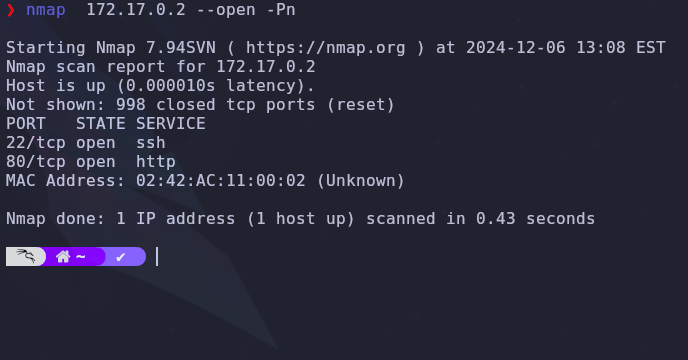
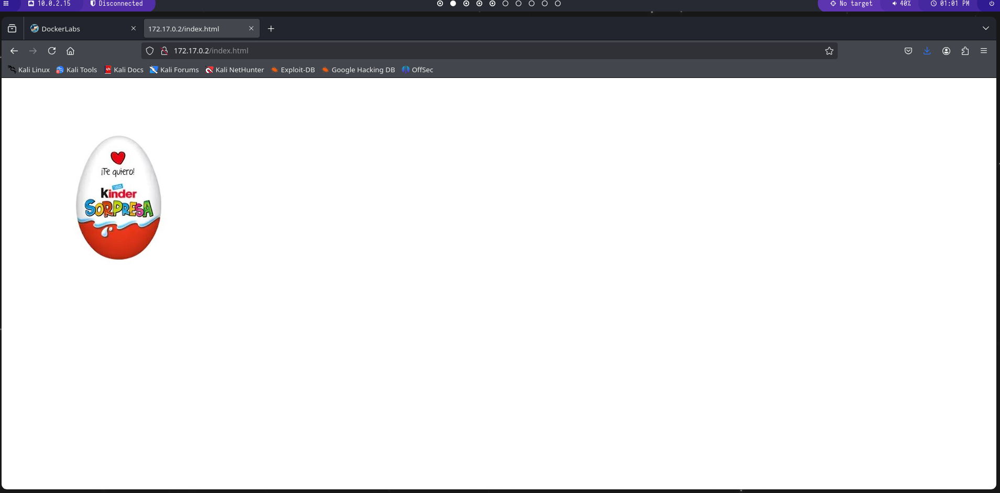
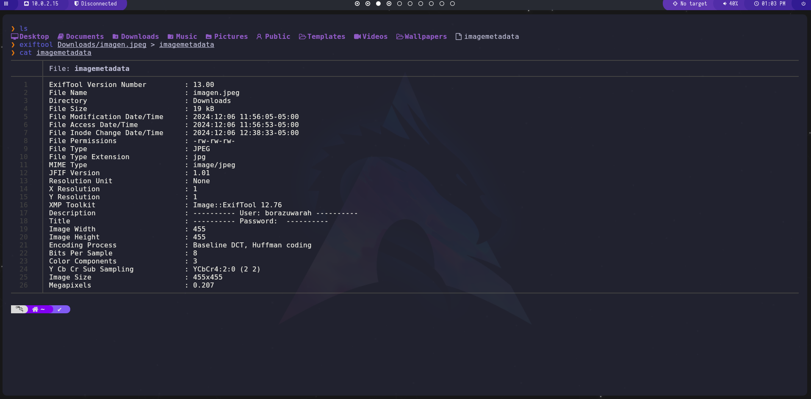
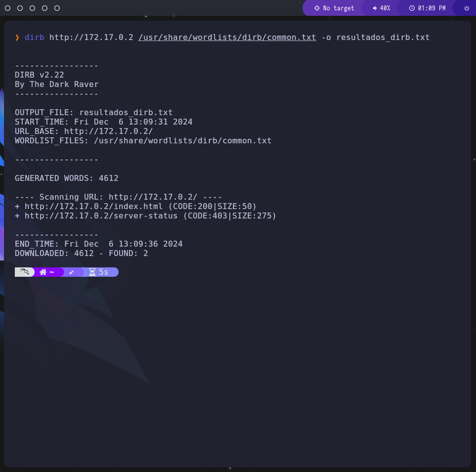
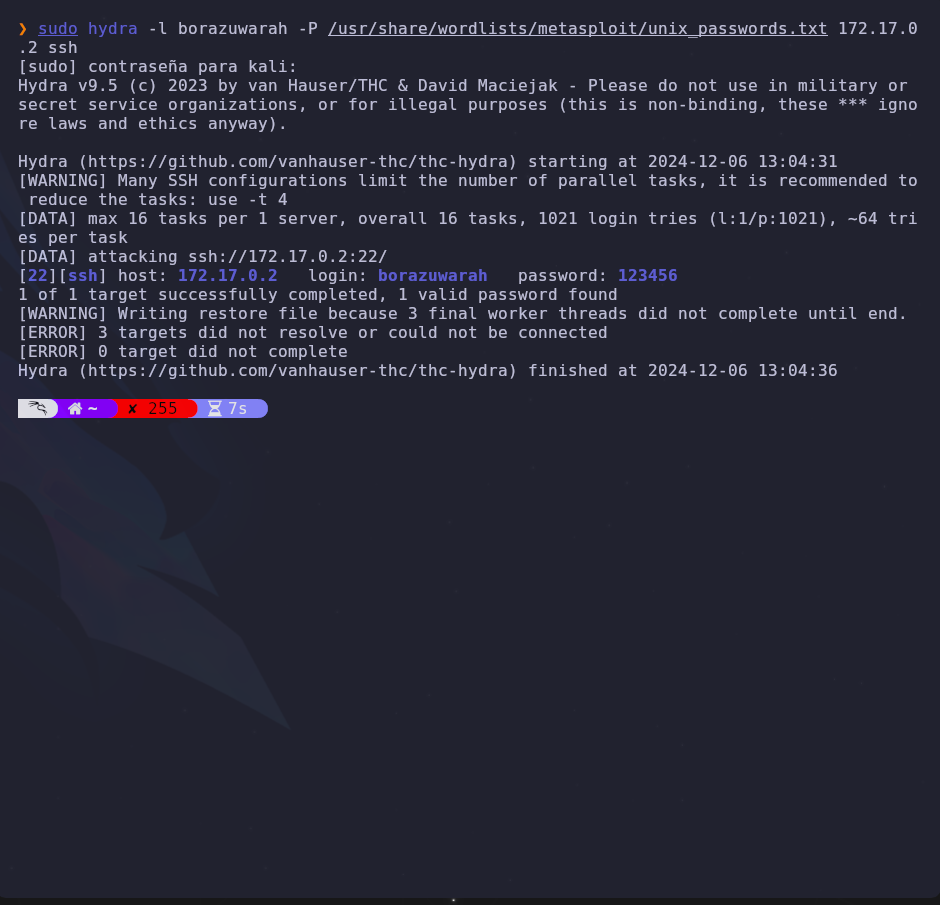
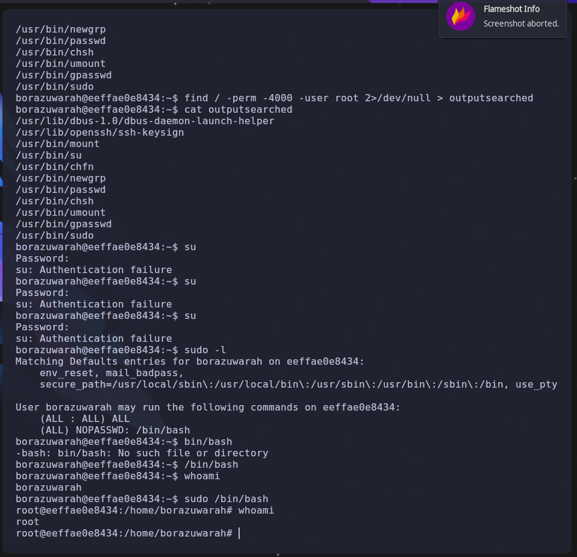

# Maquina barazuwarah Dockerlabs

## Empezamos con Nmap

<p>se Realizo un escaneo de puertos con el siguiente commando utilizando la flag -Pn para que omita el host esto segun aprendi evita que algun servidor que pueda rechazar la conexion por busqueda del host y --open devolviendome los puertos abiertos</p>

```
nmap 172.17.0.2 --open -Pn

```



<p>al encontrar los puertos 22/80 se realizo un busqueda en el navegador</p>

## url



<p>Se encontro esta imagen la cual se desconocia que se podia hacer se le pregunto a chatgpt y chatgpt recomendo buscar en los metadatos esto agilizo la prueba ya que utilizando exiftool se obtuvo informacion valiosa recomendada por la misma</p>

### metadatos



<p> Al obtener el usuario se intento acceder al usuario ssh sin tener exito por falta de la contraseña  se empezo con la busqueda de mas dir en la IP </p>

#### escaneo con dirb



<p> sin tener directorios para buscar se preocedio ha hacer un ataque con hydra pasandole el usuario</p>

### Hydra

```
hydra -l borazuwarah -P /usr/share/wordlist/rockyou.txt 172.17.0.2 ssh

```



<p>La cual nos devuelve la contraseña 123456 con esta accedemos al servicio y nos posicionamos en una consola linux </p>

### Ejecucion para ser Root

<p>ejecutamos el siguien comando con el objetivo de buscar archivos con el bit SUID activado que son propiedad del usuario roo</p>

```
find / -perm -4000 -user root 2>/dev/null
```

<p>sin encontrar algo clave se precedio con el siguiente comando </p>

## root

```
sudo -l

sudo /bin/bash
```

<p>con este segudo ya nos convertimos en usuario root </p>


